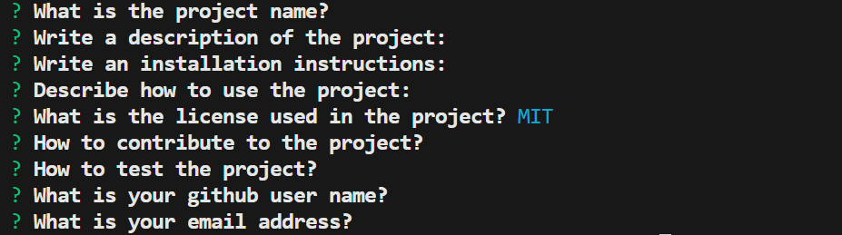

  
# README Generator

## Description
This program allows to automatically generate a README file based on the user inputs provided

## Table of Contents
- [Description](#description)
- [Installation](#installation)
- [Usage](#usage)
- [License](#license)
- [How to Contribute](#contribute)
- [Tests](#tests)
- [Contact](#contact)

## Installation
Use `git clone git@github.com:Raam337/ReadMeGen.git`  to get the source code

## Usage
To use the program type `node index.js` when located in the same directory

## License
This project uses MIT license. Please refer to LICENSE file for more information.

## How to Contribute
Please email the creator to contribute to the project

## Tests
Once the node index.js command is run the dialog window should appear

## Contact
- **Github address:** github.com/Raam337
- **Email:** abc@gmail.com
